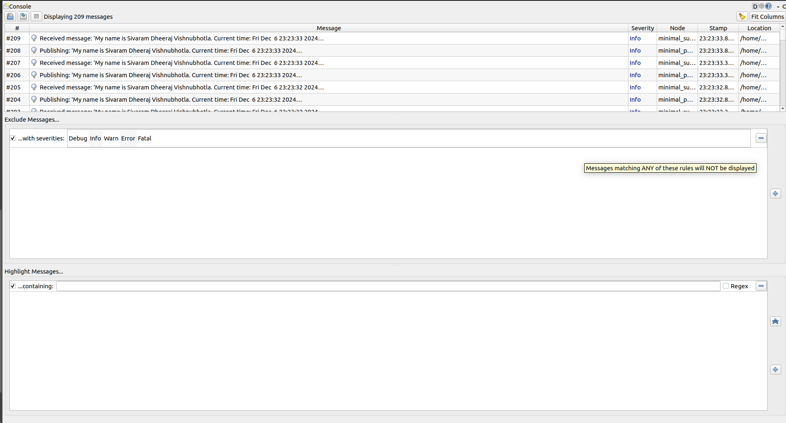

# my_beginner_tutorials

#### Course: ENPM700 ( Software development for Robotics )

#### ROS2 Programming assignment

## Overview
This repository contains a simple ROS 2 publisher node that publishes a custom string message. 

# Programming Assignment 1

## Directory Structure
```
my_beginner_tutorials/             # Root GitHub repository 
│   ├── CMakeLists.txt             # Build instructions
│   ├── LICENSE                    # License file (optional but recommended)
│   ├── package.xml                # Package dependencies
│   ├── README.md                  # Documentation for the package
│   ├── src/                       # Source code folder
│   │   ├── publisher_node.cpp     # Publisher node code
│   │   └── subscriber_node.cpp    # Subscriber node code (if applicable)
│   ├── results/                   # Folder for linting and analysis output
│   │   ├── cpplint_output.txt     # Output from cpplint
│   │   └── clang_tidy_output.txt  # Output from clang-tidy
└── .git                           # Git directory (automatically created)
```

# Programming Assignment 2
## Directory Structure

```
my_beginner_tutorials/
├── srv/
│   ├── ChangeString.srv
├── launch/
│   ├── pubsub_launch.launch.py
├── src/
│   ├── publisher_node.cpp  # Publisher node that demonstrates ROS2 C++ publishing
│   ├── subscriber_node.cpp # Subscriber node that demonstrates ROS2 C++ subscription
├── results/
|   ├── clang-tidy.txt # Output generated by clang-tidy command
|   ├── cpplint.txt # Output generated by cpplint command
|   ├── other outputs....
├── .gitignore
├── CMakeLists.txt
├── package.xml
├── LICENSE
├── README.md
```

# Programming Assignment 3
## Directory Structure

```
my_beginner_tutorials/
├── srv/
│   ├── ChangeString.srv
├── launch/
│   ├── pubsub_launch.launch.py
│   ├── bag_launch.launch.py
│   ├── test.launch.py
├── src/
│   ├── publisher_node.cpp  # Publisher node that demonstrates ROS2 C++ publishing
│   ├── subscriber_node.cpp # Subscriber node that demonstrates ROS2 C++ subscription
├── results/
|   ├── clang-tidy.txt # Output generated by clang-tidy command
|   ├── cpplint.txt # Output generated by cpplint command
|   ├── other outputs....
├── test/
│   ├── test_talker.cpp 
├── .gitignore
├── CMakeLists.txt
├── package.xml
├── LICENSE
├── README.md
```

## publisher_node.cpp

A file that comprises a basic ROS2 C++ publisher node that demonstrates the use of a publisher for sending messages. A costum string is published suing the publisher node.

## subscriber_node.cpp
A file that comprises a basic ROS2 C++ subscriber node that demonstrates the use of a subscribing for receiving messages. A costum string which is published by the publisher node is subscribed using the subscriber node.

## ROS2 Dependencies:

1. rclcpp: The ROS Client Library for C++.
2. std_msgs: Standard ROS message types, including strings and integers.
3. Additional dependencies necessary for building ROS2 nodes.

If you are not sure what packages you have or require everything from the start. Run the following command.

```bash
./scripts/install.sh
```

## How to Build and Run

In the root directory of this repository, use the following commands to build the ROS2 package:

```bash
colcon build --packages-select beginner_tutorials
```

### How to Run the Nodes

After building the package, run the publisher and subscriber nodes using the following commands:
`Ensure that the ROS2 environment is properly sourced before running the nodes.(source install/setup.bash[zsh])`

**Just run the nodes to test functionality of publisher and subscriber**

1. **Run the publisher node:**
   ```bash
   ros2 run beginner_tutorials publisher
   ```

2. **Run the subscriber node:**
   ```bash
   ros2 run beginner_tutorials subscriber
   ```

**Run below commands to check the functionality of the Service created with custom srv file**
```bash
# Using launch file to run both publisher and subscriber together with custom frequency (Terminal 1)
ros2 launch beginner_tutorials pubsub_launch.launch.py message_content:="This is Dheeraj"

# Calling the service with modified request message (Terminal 2)
ros2 service call /change_message beginner_tutorials/srv/ChangeString "{message: 'I am Sivaram Dheeraj Vishnubhotla'}"

```
**Run below commands to check the functionality of the Rosbag**
- Terminal 1
   ```bash
   # Using launch file to run both publisher and subscriber together with rosbag option true.(Terminal 1)
   # You can set record_bag to false if you dont want to record the messages 
   # You can set stop to True if you want the program to stop automatically after 15 seconds
   ros2 launch beginner_tutorials bag_launch.launch.py record_bag:=True stop:=True message_content:="This is Dheeraj Vishnubhotla"

   # To view the rosbag info. Be in the current directory only
   ros2 bag info results/bag_list
   
   # To play the rosbag. Check the rosbag file name
   ros2 bag play results/bag_list/bag_list_0.db3
   # or
   ros2 bag play results/bag_list/["ros bag file name"]
   ```
- Terminal 2
   ```bash
   # Run the listener node to get the recorded messages
   ros2 run beginner_tutorials subscriber
   ```
**Run below commands to check the functionality of the Ros2 TF Frames**
```bash
# Using launch file to run both publisher and subscriber together with rosbag option true and freq(Terminal 1)
ros2 launch beginner_tutorials bag_launch.launch.py record_bag:=True message_content:="This is Dheeraj Vishnubhotla"

# To check the frames transformation
ros2 run tf2_ros tf2_echo world talk
# To view the frames mapping
ros2 run tf2_tools view_frames -o results/frames
# frames.pdf is saved in the results directory
```
**Run below commands to check the functionality of the GTest**
```bash
# From your current directory of workspace such as ros2_ws, run the below command
colcon test --event-handlers console_direct+ --packages-select beginner_tutorials
```

## Static Code Analysis with `clang-tidy` and `cpplint`

We use static analysis tools to ensure code quality and consistency.These commands are used for static code analysis.

### `clang-tidy` Command

Run `clang-tidy` with the following command to check for potential issues in the code:

```bash
clang-tidy src/*.cpp test/*cpp > results/clang-tidy.txt
```
**or**
```bash
clang-tidy --extra-arg=-stdlib=libc++ --extra-arg=-I/usr/include/c++/11 --extra-arg=-I/usr/include/x86_64-linux-gnu/c++/11 src/*.cpp test/*cpp > results/clang-tidy.txt
```

- **`-p ./`**: Specifies the location of the `compile_commands.json` file.
- **`--extra-arg=-stdlib=libc++`**: Specifies the standard library to be used for analysis (in this case, `libc++`).
- **`--extra-arg=-I/usr/include/c++/11` and `--extra-arg=-I/usr/include/x86_64-linux-gnu/c++/11`**: Adds the necessary include paths for the C++ standard library and architecture-specific directories.
- **`src/*.cpp`**: Finds all `.cpp` files in the src folder.
- **`test/*.cpp`**: Finds all `.cpp` files in the test folder.

### `cpplint` Command

Run `cpplint` to check the style of the C++ code using this command:

```bash
cpplint --filter=-build/c++11,+build/c++17,-build/namespaces,-build/include_order  src/*.cpp test/*cpp >  results/cpplint.txt;
```

- **`cpplint`**: This is the command-line tool for checking C++ code style against Google’s C++ style guide. It flags potential style violations to help maintain consistent code style.

- **`--filter=<rules>`**: The `--filter` flag allows you to include or exclude specific linting rules. Each rule is prefixed with `+` (to include) or `-` (to exclude).

  - **`-build/c++11`**: Excludes rules that enforce C++11 standard practices, allowing more modern C++ standards to be used without warnings.

  - **`+build/c++17`**: Includes rules specific to the C++17 standard, so code is checked against C++17 best practices.

  - **`-build/namespaces`**: Disables checks for namespace style issues, which might be useful if your project has specific namespace conventions.

  - **`-build/include_order`**: Disables checks for include order rules, which can be helpful if your project has a custom include ordering.

- **`src/*.cpp`**: Specifies all `.cpp` files in the `src` directory as the input files for linting.

- **`test/*.cpp`**: Specifies all `.cpp` files in the `test` directory as the input files for linting.

- **`> results/cpplint.txt`**: Redirects the output of the linting results to a file called `cpplint.txt` in the `results` directory. This allows you to review linting feedback later without cluttering the terminal output.

This command runs `cpplint` on all `.cpp` files in the `src` and `test` directory, applies specific filters to customize the linting rules, and saves the output to `results/cpplint.txt`.

## Terminal output

Below is an example of the terminal output after running the publisher and subscriber nodes:

### Programming Assignment 1


### Programming Assignment 2
- RQT console with two levels of logging.

   

- Terminal output with service call

   

### Programming Assignment 3

- PDF of the frames transformation:

   [](/results/frames.pdf)

- Terminal output of rosbag and listener

   

- Terminal output of Integration Catch2 Ros Test

   
