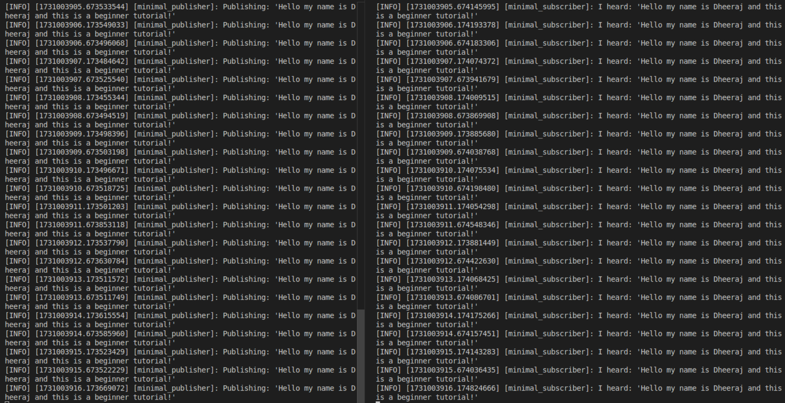

# my_beginner_tutorials

#### Course: ENPM700 ( Software development for Robotics )

#### ROS2 Programming assignment

## Overview
This repository contains a simple ROS 2 publisher node that publishes a custom string message. 


## Directory Structure
```
my_beginner_tutorials/             # Root GitHub repository 
│   ├── CMakeLists.txt             # Build instructions
│   ├── LICENSE                    # License file (optional but recommended)
│   ├── package.xml                # Package dependencies
│   ├── README.md                  # Documentation for the package
│   ├── src/                       # Source code folder
│   │   ├── publisher_node.cpp     # Publisher node code
│   │   └── subscriber_node.cpp    # Subscriber node code (if applicable)
│   ├── results/                   # Folder for linting and analysis output
│   │   ├── cpplint_output.txt     # Output from cpplint
│   │   └── clang_tidy_output.txt  # Output from clang-tidy
└── .git                           # Git directory (automatically created)
```

## Build Instructions
```bash 
colcon build --packages-select beginner_tutorials 

source /ros_workspace/install/setup.bash

ros2 run beginner_tutorials publisher_node
```

## publisher.cpp

A file that comprises a basic ROS2 C++ publisher node that demonstrates the use of a publisher for sending messages. A costum string is published suing the publisher node.

## subscriber.cpp
A file that comprises a basic ROS2 C++ subscriber node that demonstrates the use of a subscribing for receiving messages. A costum string which is published by the publisher node is subscribed using the subscriber node.

## ROS2 Dependencies:

1. rclcpp: The ROS Client Library for C++.
2. std_msgs: Standard ROS message types, including strings and integers.
3. Additional dependencies necessary for building ROS2 nodes.

Ensure you have the ROS2 Humble version (or the relevant ROS2 distribution) installed on your system, and don’t forget to source the ROS2 setup script.

## Terminal Output:


