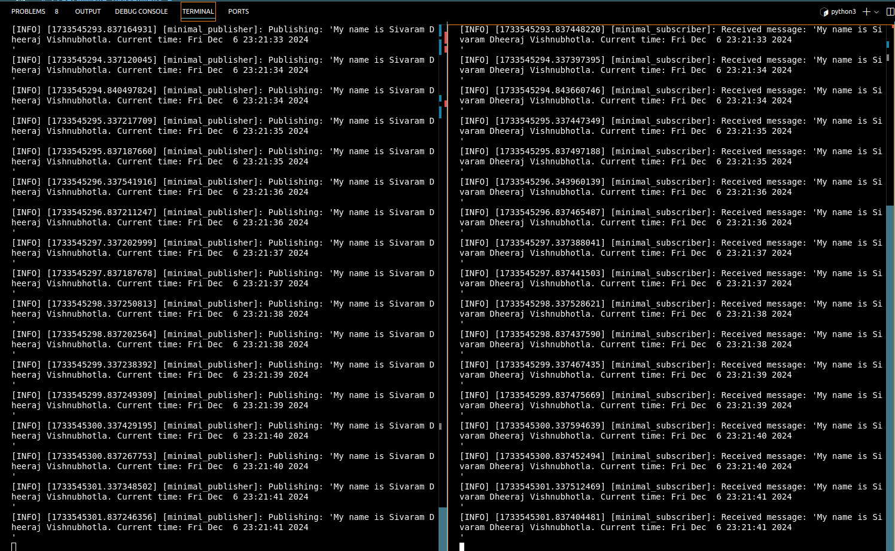

# my_beginner_tutorials

#### Course: ENPM700 ( Software development for Robotics )

#### ROS2 Programming assignment

## Overview
This repository contains a simple ROS 2 publisher node that publishes a custom string message. 

<<<<<<< HEAD
=======
# Programming Assignment 1
>>>>>>> 8c9c43e (Correct changes)

## Directory Structure
```
my_beginner_tutorials/             # Root GitHub repository 
│   ├── CMakeLists.txt             # Build instructions
│   ├── LICENSE                    # License file (optional but recommended)
│   ├── package.xml                # Package dependencies
│   ├── README.md                  # Documentation for the package
│   ├── src/                       # Source code folder
│   │   ├── publisher_node.cpp     # Publisher node code
│   │   └── subscriber_node.cpp    # Subscriber node code (if applicable)
│   ├── results/                   # Folder for linting and analysis output
│   │   ├── cpplint_output.txt     # Output from cpplint
│   │   └── clang_tidy_output.txt  # Output from clang-tidy
└── .git                           # Git directory (automatically created)
```

<<<<<<< HEAD
=======
# Programming Assignment 2
## Directory Structure

```
my_beginner_tutorials/
├── srv/
│   ├── ChangeString.srv
├── launch/
│   ├── pubsub_launch.launch.py
├── src/
│   ├── publisher_node.cpp  # Publisher node that demonstrates ROS2 C++ publishing
│   ├── subscriber_node.cpp # Subscriber node that demonstrates ROS2 C++ subscription
├── results/
|   ├── clang-tidy.txt # Output generated by clang-tidy command
|   ├── cpplint.txt # Output generated by cpplint command
|   ├── other outputs....
├── .gitignore
├── CMakeLists.txt
├── package.xml
├── LICENSE
├── README.md
```

>>>>>>> 8c9c43e (Correct changes)
## Build Instructions
```bash 
colcon build --packages-select beginner_tutorials 

source /ros_workspace/install/setup.bash

ros2 run beginner_tutorials publisher_node
```

<<<<<<< HEAD
## publisher.cpp

A file that comprises a basic ROS2 C++ publisher node that demonstrates the use of a publisher for sending messages. A costum string is published suing the publisher node.

## subscriber.cpp
=======


## publisher_node.cpp

A file that comprises a basic ROS2 C++ publisher node that demonstrates the use of a publisher for sending messages. A costum string is published suing the publisher node.

## subscriber_node.cpp
>>>>>>> 8c9c43e (Correct changes)
A file that comprises a basic ROS2 C++ subscriber node that demonstrates the use of a subscribing for receiving messages. A costum string which is published by the publisher node is subscribed using the subscriber node.

## ROS2 Dependencies:

1. rclcpp: The ROS Client Library for C++.
2. std_msgs: Standard ROS message types, including strings and integers.
3. Additional dependencies necessary for building ROS2 nodes.

Ensure you have the ROS2 Humble version (or the relevant ROS2 distribution) installed on your system, and don’t forget to source the ROS2 setup script.

<<<<<<< HEAD
## Terminal Output:


=======
## How to Build and Run

In the root directory of this repository, use the following commands to build the ROS2 package:

```bash
colcon build --packages-select beginner_tutorials
```

## Static Code Analysis with `clang-tidy` and `cpplint`

We use static analysis tools to ensure code quality and consistency. Below are the commands to run these tools. The static code analysis is done simultaneously while building the package. These commands are used for static code analysis.

### `clang-tidy` Command

Run `clang-tidy` with the following command to check for potential issues in the code:

```bash
clang-tidy -p ./build --extra-arg=-stdlib=libc++ --extra-arg=-I/usr/include/c++/11 --extra-arg=-I/usr/include/x86_64-linux-gnu/c++/11 src/*.cpp &> results/clang-tidy.txt
```

- **`-p ./`**: Specifies the location of the `compile_commands.json` file.
- **`--extra-arg=-stdlib=libc++`**: Specifies the standard library to be used for analysis (in this case, `libc++`).
- **`--extra-arg=-I/usr/include/c++/11` and `--extra-arg=-I/usr/include/x86_64-linux-gnu/c++/11`**: Adds the necessary include paths for the C++ standard library and architecture-specific directories.
- **`src/*.cpp`**: Finds all `.cpp` files in the src folder.

### `cpplint` Command

Run `cpplint` to check the style of the C++ code using this command:

```bash
cpplint --filter=-build/c++11,+build/c++17,-build/namespaces,-build/include_order  src/*.cpp >  results/cpplint.txt;
```

- **`cpplint`**: This is the command-line tool for checking C++ code style against Google’s C++ style guide. It flags potential style violations to help maintain consistent code style.

- **`--filter=<rules>`**: The `--filter` flag allows you to include or exclude specific linting rules. Each rule is prefixed with `+` (to include) or `-` (to exclude).

  - **`-build/c++11`**: Excludes rules that enforce C++11 standard practices, allowing more modern C++ standards to be used without warnings.

  - **`+build/c++17`**: Includes rules specific to the C++17 standard, so code is checked against C++17 best practices.

  - **`-build/namespaces`**: Disables checks for namespace style issues, which might be useful if your project has specific namespace conventions.

  - **`-build/include_order`**: Disables checks for include order rules, which can be helpful if your project has a custom include ordering.

- **`src/*.cpp`**: Specifies all `.cpp` files in the `src` directory as the input files for linting.

- **`> results/cpplint.txt`**: Redirects the output of the linting results to a file called `cpplint.txt` in the `results` directory. This allows you to review linting feedback later without cluttering the terminal output.

This command runs `cpplint` on all `.cpp` files in the `src` directory, applies specific filters to customize the linting rules, and saves the output to `results/cpplint.txt`.

## Terminal output

Below is an example of the terminal output after running the publisher and subscriber nodes:

### Programming Assignment 1


### Programming Assignment 2
- RQT console with two levels of logging.

   

- Terminal output with service call

   
>>>>>>> 8c9c43e (Correct changes)
